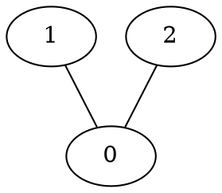

# GLAM: Graph Layout Aesthetic Metrics
A high-performance implementation for computing graph layout aesthetic metrics described in [our paper](https://goo.gl/Y8e9iH):
```bibtex
@article{kwon18wgl,
    title={{What Would a Graph Look Like in This Layout? A Machine Learning Approach to Large Graph Visualization}},
    author={Kwon, Oh-Hyun and Crnovrsanin, Tarik and Ma, Kwan-Liu},
    journal={IEEE Transactions on Visualization and Computer Graphics},
    year={2018},
    volume={24},
    number={1},        
    note = {To appear}
}
```

## Requirements
- C++11 or higher
- [Boost](http://www.boost.org/) 1.62 or higher
- [Intel TBB](https://www.threadingbuildingblocks.org/)
- [OpenCL](https://www.khronos.org/opencl/)
- [CGAL](https://www.cgal.org/)
- [JSON for Modern C++ (included)](https://github.com/nlohmann/json)

## Build
```shell
mkdir build
cd build
cmake .. -DCMAKE_BUILD_TYPE=Release; make
```

## Usage
```shell
# glam FILEPATH(s) -m METRIC(s)
> ./glam ../data/karate.dot -m crosslessness
Loading graph: ../data/karate.json
Computing metric: crosslessness
crosslessness=0.96302 (num_edge_crossings=72)

# multiple files and metrics
> ./glam ../data/karate.dot ../data/power.json -m crosslessness shape_gabriel
Loading graph: ../data/karate.dot
Computing metric: crosslessness
crosslessness=0.96302 (num_edge_crossings=72)
Computing metric: shape_gabriel
shape_gabriel=0.376176

Loading graph: ../data/power.json
Computing metric: crosslessness
crosslessness=0.999888 (num_edge_crossings=2426)
Computing metric: shape_gabriel
shape_gabriel=0.320775

# help
> ./glam --help
Options:
   -i [ --input-file ] arg input file(s)
   -m [ --metric ] arg     metric(s) to compute. Available metrics:
                           crosslessness, edge_length_cv, shape_gabriel,
                           shape_delaunay
   --help                  print help message
```

## Metrics
`crosslessness`: This metric is defined in [H. C. Purchase. Metrics for Graph Drawing Aesthetics. Journal of Visual Languages and Computing, 13(5):501–516, 2002](http://www.sciencedirect.com/science/article/pii/S1045926X02902326).
```shell
> ./glam ../data/cond-mat.json -m crosslessness
Loading graph: ../data/cond-mat.json
Computing metric: crosslessness
crosslessness=0.995231 (num_edge_crossings=5396100)
```

`edge_length_cv`: This metric is defined in [S. Hachul and M. Junger. Large-Graph Layout Algorithms at Work: An Experimental Study. Journal of Graph Algorithms and Applications, 11(2):345–369, 2007](http://jgaa.info/getPaper?id=150). The normalized definition is in [our paper](https://goo.gl/Y8e9iH).
```shell
> ./glam ../data/cond-mat.json -m edge_length_cv
Loading graph: ../data/cond-mat.json
Computing metric: edge_length_cv
edge_length_cv=0.724552 (normalized_cv=0.00332122)
```

`min_angle`: This metric is defined in [H. C. Purchase. Metrics for Graph Drawing Aesthetics. Journal of Visual Languages and Computing, 13(5):501–516, 2002](http://www.sciencedirect.com/science/article/pii/S1045926X02902326).
```shell
> ./glam ../data/cond-mat.json -m min_angle
Loading graph: ../data/cond-mat.json
Computing metric: min_angle
min_angle=0.397181
```

`shape_delaunay`: This metric is defined in [P. Eades, S.-H. Hong, A. Nguyen, and K. Klein. Shape-Based Quality Metrics for Large Graph Visualization. Journal of Graph Algorithms and Applications, 21(1):29–53, 2017](http://jgaa.info/getPaper?id=405).
```shell
> ./glam ../data/power.json -m shape_delaunay
Loading graph: ../data/power.json
Computing metric: shape_delaunay
shape_delaunay=0.274121
```

`shape_gabriel`: This metric is defined in [P. Eades, S.-H. Hong, A. Nguyen, and K. Klein. Shape-Based Quality Metrics for Large Graph Visualization. Journal of Graph Algorithms and Applications, 21(1):29–53, 2017](http://jgaa.info/getPaper?id=405).
```shell
> ./glam ../data/power.json -m shape_gabriel
Loading graph: ../data/power.json
Computing metric: shape_gabriel
shape_gabriel=0.320775
```

## Data format
See [data](data) directory for example data files. The example data are obtained from [`graph-tool`](https://graph-tool.skewed.de/).

Graphviz dot format:


JSON format:
```json
{
    "nodes": [
        {"x": -17.872019430477007, "y": 24.520299748437747},
        {"x": -13.634590227372781, "y": 20.438110276467413},
        {"x": -16.009214853752148, "y": 16.771614256121076}
    ],
    "links": [
        {"source": 0, "target": 1},
        {"source": 0, "target": 2}
    ]
}
```
